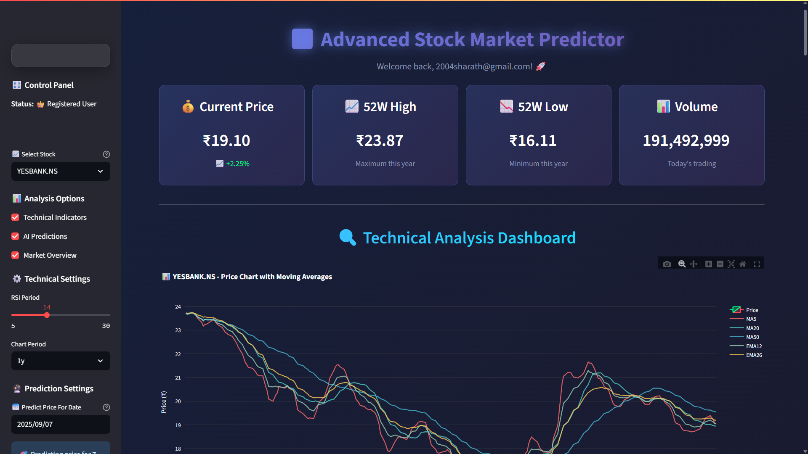

# 📊 Advanced Stock Predictor AI

## 🚀 **Project Overview**

Advanced Stock Predictor AI is a sophisticated machine learning-powered web application built with Streamlit that provides real-time stock analysis, technical indicators, and AI-driven price predictions for Indian penny stocks. The application combines traditional technical analysis with cutting-edge machine learning algorithms to deliver comprehensive investment insights.


## ✨ **Key Features**

### 🎯 **Core Functionality**
- **Real-time Stock Data**: Live market data integration using Yahoo Finance API
- **Technical Analysis**: Advanced indicators including RSI, MACD, Bollinger Bands, and Moving Averages
- **AI Predictions**: Multiple machine learning models for price forecasting
- **Interactive Charts**: Dynamic, responsive visualizations with Plotly
- **User Authentication**: Secure login system with demo and registered user support
- **Market Overview**: Real-time market snapshot with key metrics

### 🤖 **AI & Machine Learning**
- **Random Forest Regressor**: Ensemble learning for robust predictions
- **Gradient Boosting**: Sequential learning for capturing complex patterns
- **Linear Regression**: Baseline model for trend analysis
- **Feature Engineering**: 20+ technical indicators and derived features
- **Model Confidence Scoring**: Reliability metrics for each prediction
- **Ensemble Predictions**: Combined model outputs for enhanced accuracy
- **AI Market Insights**: Interactive chatbot with smart ticker detection for real-time stock queries
- **Multi-Provider Support**: Local Ollama, OpenRouter, and Google Gemini integration

### 📈 **Technical Analysis Tools**
- **RSI (Relative Strength Index)**: Momentum oscillator for overbought/oversold conditions
- **MACD**: Trend-following momentum indicator
- **Moving Averages**: SMA and EMA for trend identification
- **Bollinger Bands**: Volatility and price level analysis
- **Volume Analysis**: Trading volume patterns and trends
- **Price Patterns**: Support/resistance levels and trend detection

## 🛠️ **Technology Stack**

| Category | Technology | Version |
|----------|------------|---------|
| **Backend** | Python | 3.12.4 |
| **Web Framework** | Streamlit | 1.32.0 |
| **Data Processing** | Pandas | 2.2.2 |
| **Numerical Computing** | NumPy | 1.26.4 |
| **Machine Learning** | Scikit-learn | 1.4.2 |
| **Data Visualization** | Plotly | 5.22.0 |
| **Market Data** | yfinance | 0.2.65 |
| **UI Styling** | Custom CSS | - |

## 📦 **Installation & Setup**

### **Prerequisites**
- Python 3.12+ 
- Anaconda or Miniconda (recommended)
- Git

### **Quick Start**

1. **Clone the Repository**
   ```bash
   git clone https://github.com/yourusername/advanced-stock-predictor-ai.git
   cd advanced-stock-predictor-ai
   ```

2. **Create Virtual Environment**
   ```bash
   conda create -n stock-predictor python=3.12
   conda activate stock-predictor
   ```

3. **Install Dependencies**
   ```bash
   pip install -r requirements.txt
   ```

4. **Run the Application**
   ```bash
   streamlit run main.py
   ```

5. **Access the App**
   Open your browser and navigate to `http://localhost:8504`

## 🏗️ **Project Structure**

```
📦 Advanced Stock Predictor AI
├── 📄 main.py                 # Main Streamlit application
├── 📄 ml_predictor.py         # Machine learning models and predictions
├── 📄 login.py                # User authentication system
├── 📄 requirements.txt        # Python dependencies
├── 📄 README.md              # Project documentation
├── 📁 .vscode/               # VS Code configuration
│   └── 📄 settings.json      # Python interpreter settings
├── 📁 .git/                  # Git repository
└── 📁 .venv/                 # Virtual environment (if using venv)
```

## 🎨 **Application Screenshots**

### 🏠 **Main Dashboard**

*Real-time stock metrics with animated gradient background and glass-morphism design*

### 📊 **Market Overview**

*Comprehensive market analysis with real-time data and key performance indicators*

### 📈 **Technical Analysis**
 
*Interactive candlestick charts with moving averages, RSI, MACD, and volume analysis*

### 🤖 **AI Predictions**

*Machine learning model performance comparison and future price predictions with confidence metrics*

## 🔧 **Configuration**

### **Supported Stocks**
The application currently supports these Indian penny stocks:
- YESBANK.NS (Yes Bank)
- SUZLON.NS (Suzlon Energy)
- PNB.NS (Punjab National Bank)
- IDEA.NS (Vodafone Idea)
- RPOWER.NS (Reliance Power)
- JPPOWER.NS (Jaiprakash Power)
- IRFC.NS (Indian Railway Finance)
- ONGC.NS (Oil and Natural Gas)
- IOB.NS (Indian Overseas Bank)
- TATAPOWER.NS (Tata Power)

### **Customization Options**
- **Technical Indicators**: Adjustable periods for RSI, MACD, and moving averages
- **Chart Timeframes**: 3 months to 2 years of historical data
- **ML Model Settings**: Confidence thresholds and ensemble options
- **Prediction Horizons**: 1 to 365 days ahead forecasting

## 🚀 **Usage Guide**

### **Getting Started**
1. **Launch the Application**: Run `streamlit run main.py`
2. **Login**: Use demo credentials or register as a new user
3. **Select Stock**: Choose from the dropdown list of supported stocks
4. **Configure Analysis**: Set technical indicator parameters and prediction settings
5. **View Results**: Analyze charts, technical indicators, and AI predictions

### **Key Features Walkthrough**

#### **📊 Technical Analysis**
- View real-time candlestick charts with volume
- Analyze RSI for momentum and overbought/oversold conditions
- Monitor MACD for trend changes and momentum shifts
- Track moving averages for trend identification

#### **🤖 AI Predictions**
- Train multiple ML models on historical data
- Compare model performance metrics (RMSE, R², confidence)
- Generate future price predictions with confidence intervals
- View feature importance for model interpretability
- Get trading recommendations based on AI analysis

#### **⚙️ Advanced Settings**
- Adjust technical indicator parameters
- Set prediction timeframes and confidence thresholds
- Enable/disable ensemble predictions
- Configure chart display options

## 📊 **Machine Learning Models**

### **Model Architecture**

| Model | Type | Features | Strengths |
|-------|------|----------|-----------|
| **Random Forest** | Ensemble | 20+ technical indicators | Handles non-linearity, robust to overfitting |
| **Gradient Boosting** | Sequential | Price patterns, volume data | High accuracy, learns from errors |
| **Linear Regression** | Linear | Moving averages, ratios | Fast, interpretable, good baseline |

### **Feature Engineering**
- **Price Features**: Open, High, Low, Close, Volume
- **Technical Indicators**: RSI, MACD, Bollinger Bands, Momentum
- **Moving Averages**: SMA(5,10,20,50), EMA(12,26)
- **Derived Features**: Price ratios, volatility, lag features
- **Time Features**: Day of week, month seasonality

### **Model Evaluation**
- **RMSE**: Root Mean Square Error for prediction accuracy
- **MAE**: Mean Absolute Error for average prediction deviation  
- **R² Score**: Coefficient of determination for model fit quality
- **Confidence Score**: Custom metric based on prediction reliability

## 🎨 **Design Philosophy**

### **User Experience**
- **Modern UI**: Glass-morphism design with animated gradients
- **Responsive Layout**: Optimized for desktop and mobile viewing
- **Interactive Elements**: Real-time updates and smooth transitions
- **Color Psychology**: Strategic use of colors for different signal types
- **Accessibility**: High contrast ratios and clear visual hierarchy

### **Visual Design Elements**
- **Gradient Backgrounds**: Animated color transitions
- **Glass Cards**: Translucent containers with backdrop blur
- **Signal Colors**: Green (bullish), Red (bearish), Orange (neutral)
- **Typography**: Poppins font for modern, readable text
- **Icons**: Contextual emojis for intuitive navigation

## ⚠️ **Disclaimer & Risk Warning**

> **IMPORTANT**: This application is designed for educational and research purposes only. 
> 
> **Investment Risks:**
> - Past performance does not guarantee future results
> - Stock market investments carry inherent risks
> - AI predictions are based on historical patterns and may not account for unforeseen events
> - Always conduct your own research and consult with qualified financial advisors
> - Never invest more than you can afford to lose
> 
> **Model Limitations:**
> - Predictions are probabilistic, not certainties
> - Market volatility can exceed model expectations
> - External factors (news, events, policy changes) may impact accuracy
> - Model performance may vary across different market conditions

## 🤝 **Contributing**

We welcome contributions to improve the Advanced Stock Predictor AI! Here's how you can help:

### **Development Setup**
1. Fork the repository
2. Create a feature branch (`git checkout -b feature/AmazingFeature`)
3. Make your changes
4. Commit your changes (`git commit -m 'Add some AmazingFeature'`)
5. Push to the branch (`git push origin feature/AmazingFeature`)
6. Open a Pull Request

### **Areas for Contribution**
- **New ML Models**: Implement LSTM, Prophet, or other time series models
- **Additional Indicators**: Add new technical analysis tools
- **Market Expansion**: Support for international markets
- **Performance Optimization**: Improve computational efficiency
- **UI/UX Enhancements**: Design improvements and new features
- **Testing**: Unit tests and integration tests
- **Documentation**: Improve code documentation and user guides

### **Code Style**
- Follow PEP 8 Python style guidelines
- Use meaningful variable and function names
- Add docstrings for all functions and classes
- Comment complex algorithms and business logic

## 📄 **License**

This project is licensed under the MIT License - see the [LICENSE](LICENSE) file for details.

```
MIT License

Copyright (c) 2025 Advanced Stock Predictor AI

Permission is hereby granted, free of charge, to any person obtaining a copy
of this software and associated documentation files (the "Software"), to deal
in the Software without restriction, including without limitation the rights
to use, copy, modify, merge, publish, distribute, sublicense, and/or sell
copies of the Software, and to permit persons to whom the Software is
furnished to do so, subject to the following conditions:

The above copyright notice and this permission notice shall be included in all
copies or substantial portions of the Software.

THE SOFTWARE IS PROVIDED "AS IS", WITHOUT WARRANTY OF ANY KIND, EXPRESS OR
IMPLIED, INCLUDING BUT NOT LIMITED TO THE WARRANTIES OF MERCHANTABILITY,
FITNESS FOR A PARTICULAR PURPOSE AND NONINFRINGEMENT. IN NO EVENT SHALL THE
AUTHORS OR COPYRIGHT HOLDERS BE LIABLE FOR ANY CLAIM, DAMAGES OR OTHER
LIABILITY, WHETHER IN AN ACTION OF CONTRACT, TORT OR OTHERWISE, ARISING FROM,
OUT OF OR IN CONNECTION WITH THE SOFTWARE OR THE USE OR OTHER DEALINGS IN THE
SOFTWARE.
```

## 📞 **Support & Contact**

- **Issues**: Report bugs or request features via [GitHub Issues](https://github.com/yourusername/advanced-stock-predictor-ai/issues)
- **Discussions**: Join the community discussions on [GitHub Discussions](https://github.com/yourusername/advanced-stock-predictor-ai/discussions)
- **Documentation**: Visit our [Wiki](https://github.com/yourusername/advanced-stock-predictor-ai/wiki) for detailed guides

## 🔮 **Roadmap**

### **Version 2.0 (Planned)**
- [ ] Real-time WebSocket data feeds
- [ ] Advanced LSTM neural networks
- [ ] Sentiment analysis from news/social media
- [ ] Portfolio optimization tools
- [ ] Risk management dashboard
- [ ] Mobile app development

### **Version 2.5 (Future)**
- [ ] Multi-asset support (crypto, forex, commodities)
- [ ] Algorithmic trading integration
- [ ] Advanced backtesting framework
- [ ] Cloud deployment options
- [ ] API for external integrations

## 🙏 **Acknowledgments**

- **Yahoo Finance**: For providing free market data API
- **Streamlit Team**: For the amazing web app framework
- **scikit-learn**: For robust machine learning tools
- **Plotly**: For interactive visualization capabilities
- **Open Source Community**: For the incredible tools and libraries that make this project possible

---

<div align="center">

**⭐ Star this repository if you find it helpful!**

**🍴 Fork it to create your own version!**

**🐛 Report issues to help us improve!**

</div>

---

*Last updated: August 31, 2025*
