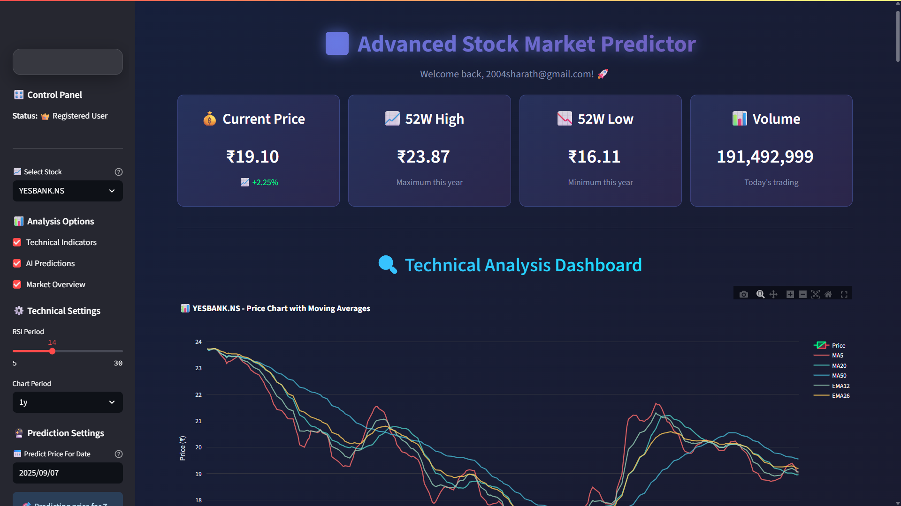

# 📸 Screenshot Guide for README

## 🎯 **How to Take Project Screenshots**

### **Required Screenshots:**

1. **📊 Main Dashboard** (`main-dashboard.png`)
   - Full application view with stock selection
   - Current price metrics and market overview
   - Sidebar with controls visible
   - Dark theme with gradient background

2. **📈 Technical Analysis** (`technical-analysis.png`)
   - Candlestick chart with moving averages
   - Volume chart below price chart
   - Technical indicators section
   - Chart controls and timeframe selector

3. **🤖 AI Predictions** (`ai-predictions.png`)
   - Model performance comparison chart
   - Future price predictions graph
   - Model metrics table
   - Confidence scores and recommendations

4. **📊 RSI & MACD Analysis** (`indicators.png`)
   - RSI chart with overbought/oversold levels
   - MACD line and histogram
   - Signal analysis panel
   - Technical stats summary

### **📋 Step-by-Step Instructions:**

#### **Preparation:**
1. ✅ Start Streamlit app: `streamlit run main.py`
2. ✅ Open browser to `http://localhost:8504`
3. ✅ Login with demo credentials
4. ✅ Select a stock (e.g., YESBANK.NS)
5. ✅ Enable all analysis features in sidebar

#### **Taking Screenshots:**

**📱 Browser Setup:**
- Use Chrome or Firefox for best results
- Set window size to 1920x1080 or higher
- Enable dark mode if available
- Zoom level: 100%

**🖼️ Screenshot Settings:**
- Format: PNG (for transparency support)
- Quality: High resolution
- Include: Full browser content area
- Exclude: Browser UI (address bar, tabs)

#### **Screenshot Locations:**

Save all screenshots in the `screenshots/` folder:
```
screenshots/
├── main-dashboard.png
├── technical-analysis.png  
├── ai-predictions.png
└── indicators.png
```

### **🔧 Tools Recommendations:**

**Windows:**
- Snipping Tool (built-in)
- Lightshot
- Greenshot

**macOS:**
- Screenshot utility (Cmd+Shift+4)
- CleanShot X
- Skitch

**Linux:**
- GNOME Screenshot
- Flameshot
- Shutter

### **🎨 Quality Guidelines:**

✅ **Good Screenshot:**
- Clear, high resolution
- All UI elements visible
- Proper lighting/contrast
- Actual data displayed (not empty charts)
- Consistent styling

❌ **Avoid:**
- Blurry or pixelated images
- Cut-off content
- Empty/loading states
- Personal information visible
- Inconsistent themes

### **📝 After Taking Screenshots:**

1. **Update README.md** - Replace placeholder text with actual image paths:
   ```markdown
   
   ```

2. **Verify Links** - Test that all images display correctly

3. **Optimize File Sizes** - Compress images if needed (keep under 1MB each)

4. **Commit to Git**:
   ```bash
   git add screenshots/
   git commit -m "Add project screenshots"
   ```

### **🚀 Pro Tips:**

- **Consistent Timing**: Take all screenshots with the same stock and timeframe
- **Real Data**: Use actual market hours for live data
- **Multiple Views**: Consider taking mobile/tablet responsive screenshots too
- **Before/After**: Show different market conditions (bullish/bearish signals)
- **Feature Highlights**: Use callouts or annotations if needed

### **🔄 Updating Screenshots:**

When you update the UI:
1. Retake affected screenshots
2. Update README.md if new features are shown
3. Keep old screenshots in `screenshots/archive/` folder
4. Update the git repository with new images

---

**💡 Need Help?** 
- Run the app and navigate through different sections
- Use the screenshot guide above
- Check existing open-source projects for inspiration
- Consider using tools like Carbon for code screenshots
