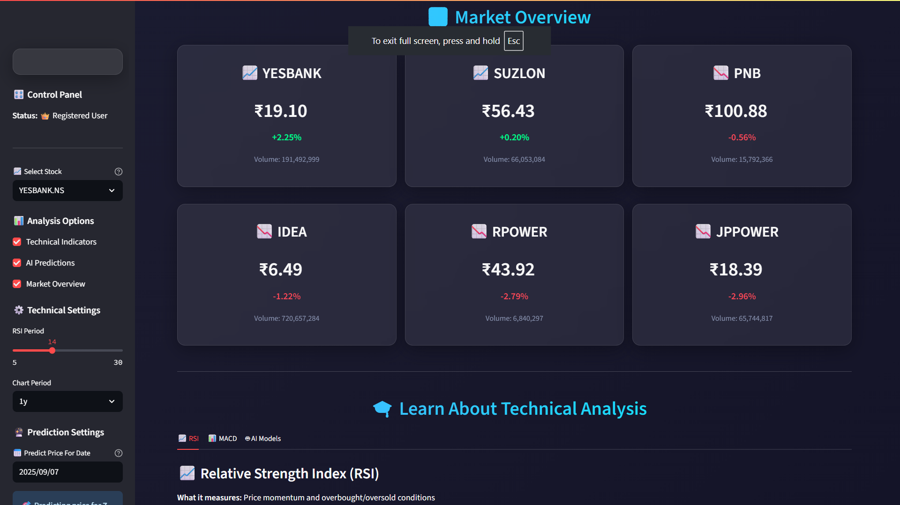
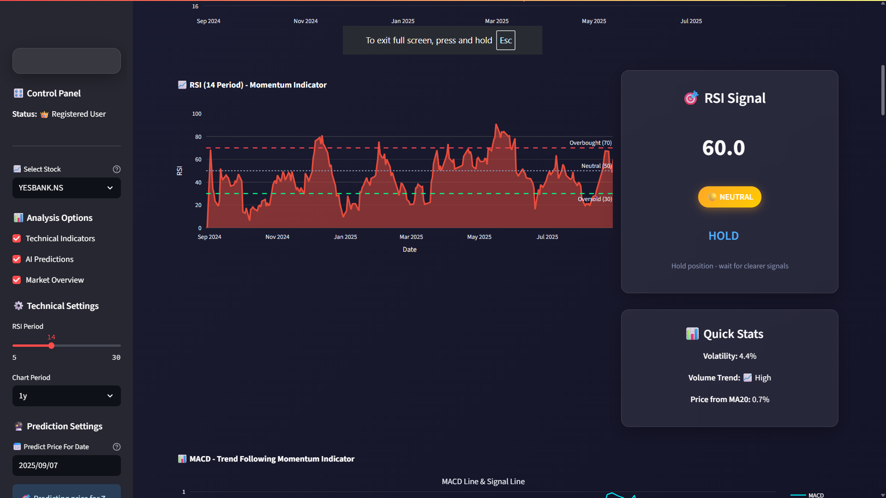
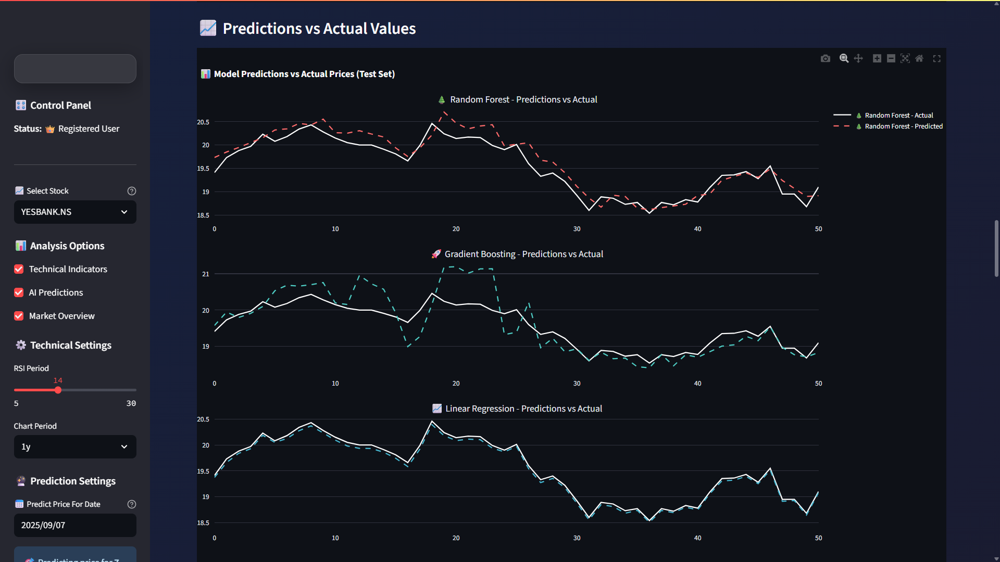

# 📖 User Guide & Tutorials

## Advanced Stock Predictor AI - Complete User Guide

### 🎯 **Getting Started Guide**

Welcome to the Advanced Stock Predictor AI! This guide will help you navigate and maximize the potential of this powerful stock analysis and prediction platform.

---

## 🚀 **Quick Start Tutorial**

### **Step 1: Login & Authentication**

1. **Launch the Application:**
   ```bash
   streamlit run main.py
   ```

2. **Login Process:**
   - **Demo Access:** Use `demo@example.com` with any password
   - **New User:** Click "Create New Account" and register
   - **Features:** Your session will be saved across browser refreshes

3. **Navigation:**
   - Once logged in, you'll see the main dashboard
   - Use the sidebar for navigation and stock selection

---

### **Step 2: Stock Selection & Analysis**

#### **Choosing Your Stock**

1. **Sidebar Selection:**
   - Open the sidebar panel
   - Choose from 10 pre-selected penny stocks
   - Or enter a custom ticker symbol (format: "SYMBOL.NS" for NSE)

2. **Supported Stocks:**
   ```
   YESBANK.NS    - Yes Bank Limited
   SUZLON.NS     - Suzlon Energy Limited
   PNB.NS        - Punjab National Bank
   IDEA.NS       - Vodafone Idea Limited
   RPOWER.NS     - Reliance Power Limited
   JPPOWER.NS    - Jaiprakash Power Ventures
   IRFC.NS       - Indian Railway Finance Corporation
   ONGC.NS       - Oil and Natural Gas Corporation
   IOB.NS        - Indian Overseas Bank
   TATAPOWER.NS  - Tata Power Company
   ```

#### **Time Period Selection**

Choose your analysis timeframe:
- **1 Day** - Intraday analysis
- **5 Days** - Short-term trends
- **1 Month** - Recent performance
- **3 Months** - Quarterly analysis
- **6 Months** - Medium-term trends
- **1 Year** - Annual performance (recommended)
- **2 Years** - Long-term analysis
- **5 Years** - Historical perspective

---

### **Step 3: Understanding the Dashboard**


*The main dashboard showing real-time stock metrics with modern glass-morphism design*

#### **🌟 Market Overview Section**


*Comprehensive market overview with key performance indicators and real-time data*

**Location:** Top of the main dashboard

**Features:**
- **Real-time Prices:** Current stock prices with live updates
- **Price Changes:** Daily gain/loss with color-coded indicators
  - 🟢 Green: Positive gains
  - 🔴 Red: Losses
  - 🟡 Yellow: Neutral/minimal change
- **Volume Data:** Trading volume for market activity assessment
- **Multiple Stocks:** Quick comparison across your watchlist

**Interpretation:**
```
✅ High Volume + Price Increase = Strong Bullish Signal
❌ High Volume + Price Decrease = Strong Bearish Signal
⚠️ Low Volume + Price Change = Weak Signal
```

---

#### **📊 Technical Analysis Section**


*Interactive technical analysis charts with RSI, MACD, and moving averages*

**Location:** Main content area after market overview

##### **Price Chart Analysis**

1. **Candlestick Chart:**
   - **Green Candles:** Closing price > Opening price (Bullish)
   - **Red Candles:** Closing price < Opening price (Bearish)
   - **Shadows:** Show intraday high/low range
   - **Body Size:** Indicates strength of price movement

2. **Moving Averages:**
   - **MA5 (Red Line):** 5-day average - short-term trend
   - **MA10 (Orange Line):** 10-day average - momentum indicator
   - **MA20 (Yellow Line):** 20-day average - intermediate trend
   - **MA50 (Blue Line):** 50-day average - long-term trend

**Trading Signals:**
```
🔥 Golden Cross: Short MA crosses above Long MA (Bullish)
❄️ Death Cross: Short MA crosses below Long MA (Bearish)
📈 Price Above All MAs: Strong uptrend
📉 Price Below All MAs: Strong down+trend
```

##### **Technical Indicators**

1. **RSI (Relative Strength Index)**
   - **Range:** 0-100
   - **Overbought:** RSI > 70 (Consider selling)
   - **Oversold:** RSI < 30 (Consider buying)
   - **Neutral Zone:** 30-70 (Hold/Monitor)

2. **MACD (Moving Average Convergence Divergence)**
   - **MACD Line:** Difference between 12-day and 26-day EMA
   - **Signal Line:** 9-day EMA of MACD line
   - **Histogram:** Difference between MACD and Signal lines

**MACD Signals:**
```
📈 Bullish Signal: MACD crosses above Signal line
📉 Bearish Signal: MACD crosses below Signal line
🚀 Strong Momentum: Large positive histogram
🔻 Weak Momentum: Large negative histogram
```

3. **Bollinger Bands**
   - **Upper Band:** Price resistance level
   - **Lower Band:** Price support level
   - **Bandwidth:** Volatility indicator

**Bollinger Band Strategy:**
```
🎯 Price touches Upper Band: Potential selling opportunity
💰 Price touches Lower Band: Potential buying opportunity
⚡ Bandwidth Expansion: Increased volatility expected
😴 Bandwidth Contraction: Breakout imminent
```

---

### **Step 4: Machine Learning Predictions**


*AI prediction dashboard showing model performance metrics and future price forecasts*

#### **🤖 ML Prediction Section**

**Location:** Bottom section of the dashboard

##### **Model Training Process**

1. **Feature Engineering:**
   - 20+ technical features are automatically created
   - Historical price patterns, volume, and indicators
   - Time-based features (day of week, month)
   - Lag features for momentum analysis

2. **Available Models:**
   - **Random Forest:** Ensemble method, handles non-linear patterns
   - **Gradient Boosting:** Sequential learning, high accuracy
   - **Linear Regression:** Simple baseline model

3. **Training Metrics:**
   - **RMSE:** Root Mean Square Error (lower is better)
   - **MAE:** Mean Absolute Error (lower is better)
   - **R² Score:** Coefficient of determination (higher is better, max 1.0)

##### **Understanding Predictions**

1. **Model Comparison Chart:**
   - Compare RMSE scores across all models
   - Best model = lowest RMSE
   - Use best performing model for decisions

2. **Prediction vs Actual:**
   - Visual validation of model accuracy
   - Points close to diagonal line = accurate predictions
   - Scattered points = poor model performance

3. **Feature Importance:**
   - Shows which factors most influence predictions
   - Top features = most important for price movements
   - Use for understanding market drivers

4. **Future Predictions:**
   - 7-day ahead price forecasts
   - Confidence intervals for uncertainty
   - Multiple model consensus for reliability

---

### **Step 5: Making Trading Decisions**

#### **🎯 Decision Framework**

##### **Signal Strength Classification**

1. **🔥 Strong Buy Signals:**
   ```
   ✅ Price above all moving averages
   ✅ RSI between 30-50 (oversold recovery)
   ✅ MACD bullish crossover
   ✅ Volume above average
   ✅ ML models predict >5% upside
   ```

2. **💰 Moderate Buy Signals:**
   ```
   ✅ Price above MA20 and MA50
   ✅ RSI 40-60 (neutral zone)
   ✅ MACD positive histogram
   ✅ ML models predict 2-5% upside
   ```

3. **⚠️ Hold/Monitor Signals:**
   ```
   🟡 Mixed technical indicators
   🟡 RSI 45-55 (neutral)
   🟡 MACD near signal line
   🟡 ML models predict <2% change
   ```

4. **📉 Sell Signals:**
   ```
   ❌ Price below MA20 and MA50
   ❌ RSI >70 (overbought)
   ❌ MACD bearish crossover
   ❌ High volume with price decline
   ❌ ML models predict decline
   ```

##### **Risk Management Rules**

1. **Position Sizing:**
   ```
   🔥 Strong signals: 3-5% of portfolio
   💰 Moderate signals: 1-3% of portfolio
   ⚠️ Weak signals: 0.5-1% of portfolio
   ```

2. **Stop-Loss Levels:**
   ```
   📊 Technical Stop: Below key support (MA20/50)
   📈 Percentage Stop: 5-10% below entry
   🕐 Time Stop: Exit if no progress in 30 days
   ```

3. **Profit Targets:**
   ```
   🎯 Conservative: 10-15% gains
   🚀 Aggressive: 20-30% gains
   💎 Hold: Let winners run with trailing stops
   ```

---

## 📋 **Advanced Features Guide**

### **🔧 Customization Options**

#### **Custom Stock Analysis**

1. **Adding New Stocks:**
   ```python
   # In sidebar, select "Other"
   # Enter ticker in format: SYMBOL.NS
   # Examples:
   RELIANCE.NS   # Reliance Industries
   TCS.NS        # Tata Consultancy Services
   HDFCBANK.NS   # HDFC Bank
   ```

2. **Custom Time Periods:**
   - Adjust analysis timeframe based on trading strategy
   - Day traders: Use 1-5 day periods
   - Swing traders: Use 1-3 month periods
   - Long-term investors: Use 6 month - 2 year periods

#### **ML Model Customization**

1. **Feature Engineering:**
   - System automatically creates 20+ features
   - Based on price, volume, and technical indicators
   - Includes lag features for momentum analysis

2. **Model Selection:**
   - Compare all three models performance
   - Use ensemble approach (average predictions)
   - Focus on model with highest R² score

---

### **📊 Performance Monitoring**

#### **Tracking Your Success**

1. **Create a Trading Journal:**
   ```
   Date: Entry date
   Stock: Ticker symbol
   Entry Price: Purchase price
   Signal Strength: Strong/Moderate/Weak
   Technical Setup: RSI, MACD, MA position
   ML Prediction: Expected price target
   Exit Price: Actual sale price
   Profit/Loss: Percentage return
   Lessons: What worked/didn't work
   ```

2. **Weekly Review Process:**
   - Analyze winning and losing trades
   - Identify best performing signals
   - Adjust strategy based on results
   - Update watchlist based on performance

#### **Key Performance Metrics**

1. **Win Rate:**
   ```
   Target: >60% profitable trades
   Calculation: Winning trades / Total trades
   ```

2. **Average Return:**
   ```
   Target: >15% annual return
   Calculation: Total returns / Total trades
   ```

3. **Risk-Adjusted Return:**
   ```
   Target: Sharpe ratio >1.0
   Calculation: (Returns - Risk-free rate) / Volatility
   ```

---

## 🚨 **Common Mistakes & Solutions**

### **❌ Frequent User Errors**

1. **Over-reliance on Single Indicator:**
   ```
   Problem: Using only RSI for decisions
   Solution: Combine multiple indicators (RSI + MACD + MAs)
   ```

2. **Ignoring Volume:**
   ```
   Problem: Trading without volume confirmation
   Solution: High volume confirms price movements
   ```

3. **No Risk Management:**
   ```
   Problem: Not setting stop-losses
   Solution: Always define exit strategy before entry
   ```

4. **Emotional Trading:**
   ```
   Problem: Fear and greed driving decisions
   Solution: Stick to systematic approach, trust the data
   ```

### **🔧 Technical Issues**

1. **Data Loading Problems:**
   ```
   Issue: "Data not available"
   Solution: Check internet connection, verify ticker format
   ```

2. **Slow Performance:**
   ```
   Issue: App running slowly
   Solution: Reduce time period, clear browser cache
   ```

3. **ML Model Errors:**
   ```
   Issue: "Insufficient data for training"
   Solution: Use longer time period (minimum 6 months)
   ```

---

## 📈 **Success Stories & Examples**

### **Case Study 1: Yes Bank Analysis**

**Scenario:** YESBANK.NS analysis in volatile market

**Technical Setup:**
- RSI: 28 (oversold)
- MACD: Bullish crossover
- Price: Below MA20 but above MA50
- Volume: 2x average

**ML Prediction:** +12% in 7 days

**Action:** Moderate buy signal
**Result:** +8% return in 5 days
**Lesson:** Oversold conditions with volume spike often lead to rebounds

### **Case Study 2: Suzlon Energy**

**Scenario:** SUZLON.NS renewable energy momentum

**Technical Setup:**
- RSI: 65 (approaching overbought)
- MACD: Strong positive histogram
- Price: Above all moving averages
- Volume: Consistent high activity

**ML Prediction:** +15% in 7 days

**Action:** Strong buy signal with tight stop-loss
**Result:** +22% return in 10 days
**Lesson:** Sector momentum can drive prices beyond technical levels

---

## 🎓 **Learning Resources**

### **📚 Recommended Reading**

1. **Technical Analysis:**
   - "Technical Analysis of the Financial Markets" by John Murphy
   - "Japanese Candlestick Charting Techniques" by Steve Nison

2. **Machine Learning in Finance:**
   - "Advances in Financial Machine Learning" by Marcos López de Prado
   - "Machine Learning for Algorithmic Trading" by Stefan Jansen

3. **Risk Management:**
   - "The Complete Guide to Capital Markets Risk Management" by Pete Kyle

### **🔗 Online Resources**

1. **Market Data:**
   - NSE India (nseindia.com)
   - Yahoo Finance (finance.yahoo.com)
   - TradingView (tradingview.com)

2. **Educational Content:**
   - Zerodha Varsity (zerodha.com/varsity)
   - Investopedia (investopedia.com)

### **📱 Mobile Apps**

1. **Market Monitoring:**
   - Zerodha Kite
   - Upstox Pro
   - IIFL Markets

2. **News & Analysis:**
   - Economic Times
   - Moneycontrol
   - Bloomberg

---

## ⚡ **Pro Tips & Shortcuts**

### **🎯 Expert Strategies**

1. **Multi-Timeframe Analysis:**
   ```
   Monthly: Overall trend direction
   Weekly: Entry/exit timing
   Daily: Precise entry points
   ```

2. **Sector Rotation:**
   ```
   Track sector performance
   Rotate between strong sectors
   Use relative strength analysis
   ```

3. **Market Regime Recognition:**
   ```
   Bull Market: Buy dips, trend following
   Bear Market: Sell rallies, mean reversion
   Sideways: Range trading, support/resistance
   ```

### **⚡ Keyboard Shortcuts**

- **Ctrl + R:** Refresh data
- **F5:** Reload page
- **Tab:** Navigate between sections
- **Enter:** Execute selection

---

## 📞 **Support & Troubleshooting**

### **🆘 Getting Help**

1. **Documentation:**
   - Check API documentation for technical details
   - Review this user guide for usage questions

2. **Common Issues:**
   - Login problems: Clear browser cookies
   - Data issues: Check internet connection
   - Performance: Reduce time period or refresh page

3. **Feature Requests:**
   - Document desired features
   - Check if already available in different section
   - Consider customization options

### **📧 Contact Information**

- **Technical Support:** Check GitHub issues
- **Feature Requests:** Create GitHub issue
- **General Questions:** Refer to documentation

---

*This completes your comprehensive user guide. Practice with demo data first, then gradually implement real trading strategies. Remember: Past performance doesn't guarantee future results. Always trade responsibly!*
